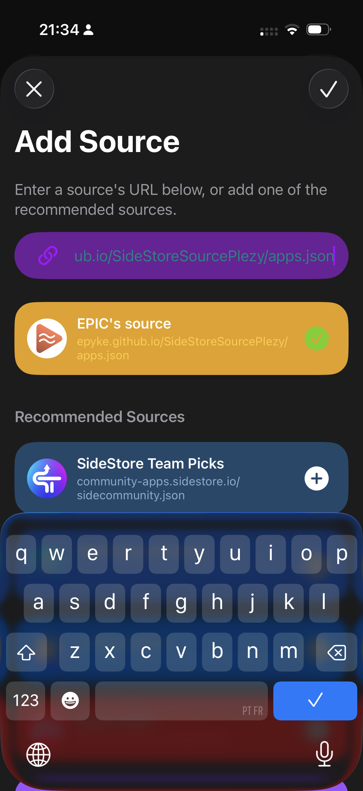
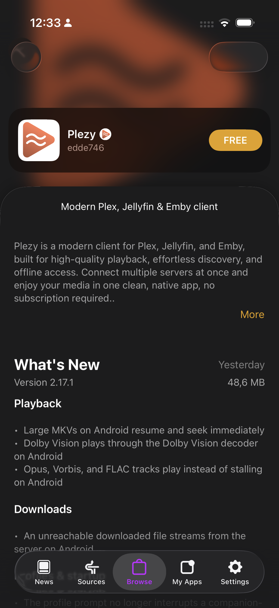

# Plezy SideStore Source

An automated [SideStore](https://sidestore.io/) repository source that tracks and distributes the latest official iOS `.ipa` releases of [Plezy](https://plezy.app/).


[Plezy](https://github.com/edde746/plezy) is an open-source, modern third-party client for Plex, Emby, and Jellyfin. 
While free to use, installing it on iOS without an App Store purchase requires sideloading via tools like **SideStore** or other alternatives. To receive automatic update notifications inside SideStore without manually downloading `.ipa` files for every release, you can add this repository's source URL.

This repository automatically generates an `apps.json` manifest linking directly to the latest release published on the [official Plezy GitHub repository](https://github.com/edde746/plezy).


## Add to SideStore

**Source URL:**
```text
https://epyke.github.io/SideStoreSourcePlezy/apps.json
```

## Preview

<p align="center">
  
  &nbsp;
  
</p>
  
## Disclaimer

This repository is an unofficial community feed and is not affiliated with, endorsed by, or maintained by [SideStore](https://github.com/SideStore/SideStore) or [Plezy](https://github.com/edde746/plezy). All trademarks, assets, and project files belong to their respective authors.